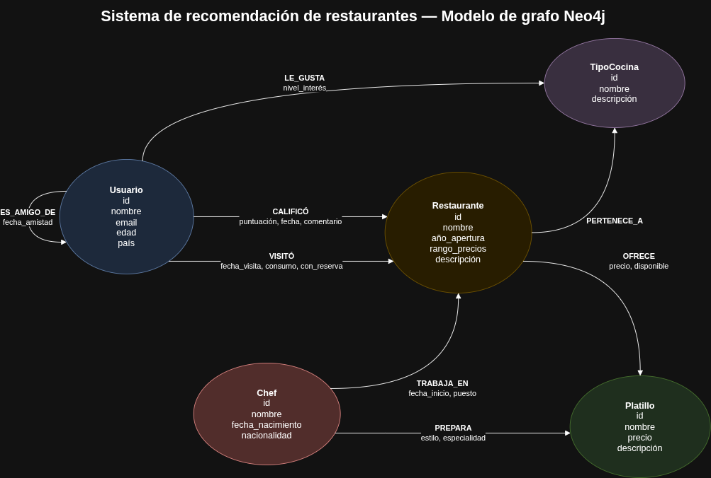
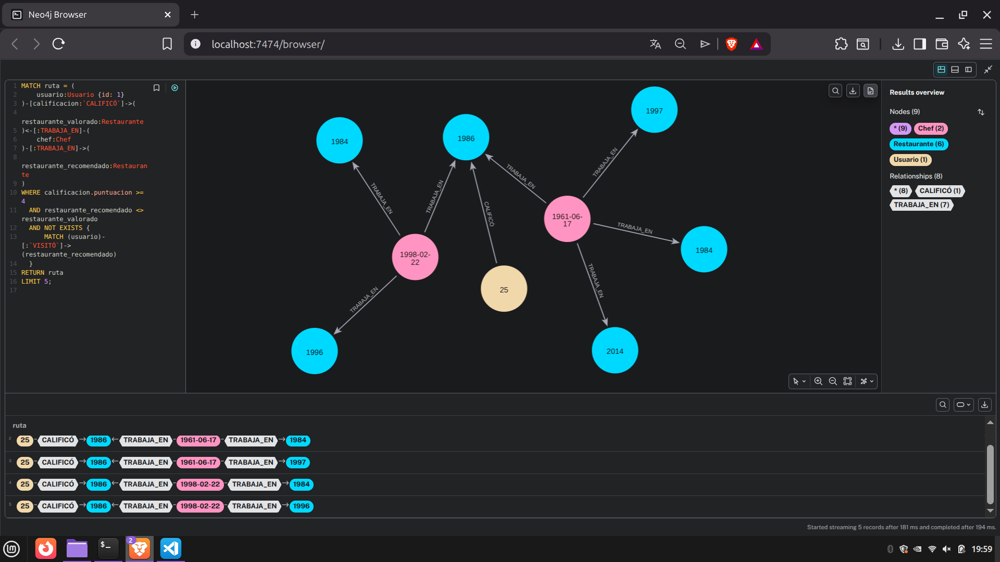
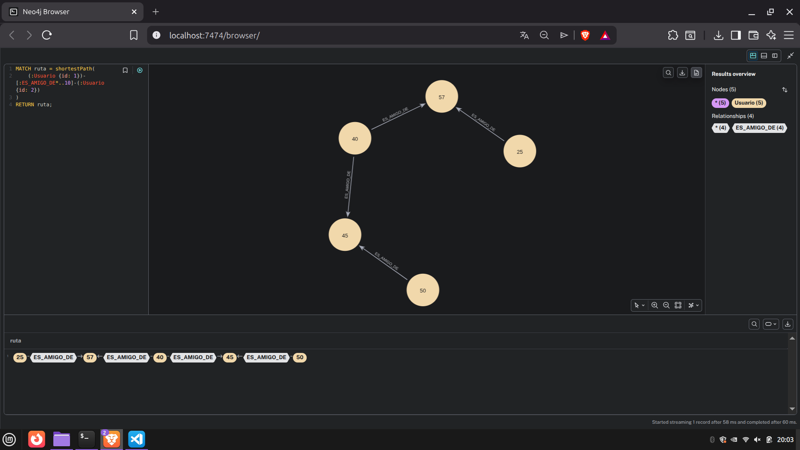
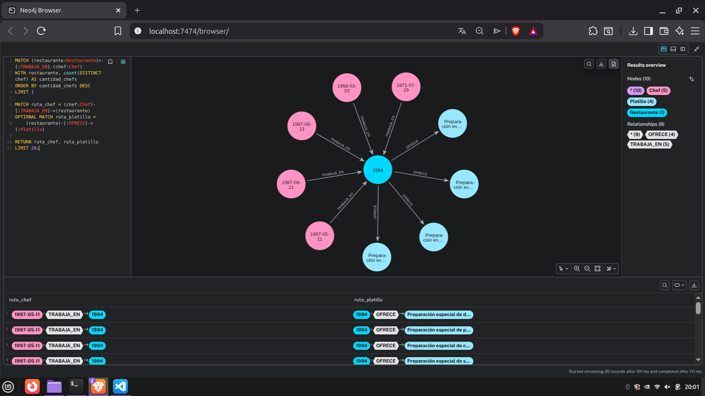

# Documentación Técnica

## Sistema de Recomendación de Restaurantes con Neo4j

### Información general

* **Estudiante:** Ludwing Alexander López Ortiz
* **Carné:** 201907608
* **Grupo:** G18
* **Curso:** Sistemas de Bases de Datos 2
* **Proyecto:** Segundo Proyecto
* **Periodo:** Vacaciones de junio 2026

---

## 1. Introducción

El proyecto consiste en el diseño e implementación de una base de datos de grafos para un sistema de recomendación de restaurantes.

Neo4j permite representar de forma natural las relaciones entre usuarios, restaurantes, chefs, platillos y tipos de cocina. Esta estructura facilita consultas que atraviesan varias conexiones y permite generar recomendaciones basadas en el comportamiento y las preferencias de los usuarios.

El sistema analiza calificaciones, visitas, amistades, preferencias gastronómicas, chefs compartidos y platillos ofrecidos.

---

## 2. Objetivos

### Objetivo general

Diseñar e implementar un sistema de recomendación de restaurantes utilizando Neo4j y consultas Cypher.

### Objetivos específicos

* Modelar las entidades principales como nodos.
* Representar las conexiones mediante relaciones con propiedades.
* Generar datos de prueba de forma automática.
* Realizar una carga masiva de nodos y relaciones.
* Implementar las nueve consultas requeridas.
* Calcular rutas más cortas entre usuarios.
* Identificar restaurantes altamente conectados.
* Generar recomendaciones basadas en chefs compartidos.
* Validar la integridad de los datos.

---

## 3. Tecnologías utilizadas

| Herramienta          | Uso                                     |
| -------------------- | --------------------------------------- |
| Neo4j Community 5.26 | Motor de base de datos de grafos        |
| Neo4j Browser        | Ejecución y visualización de consultas  |
| Cypher               | Lenguaje de consulta                    |
| Python 3.12          | Generación automática de datos          |
| Faker                | Generación de nombres y datos de prueba |
| pandas               | Manipulación de datos                   |
| Neo4j Driver         | Conexión entre Python y Neo4j           |
| Docker               | Ejecución del servidor Neo4j            |
| Docker Compose       | Configuración reproducible              |
| Draw.io              | Diseño del modelo conceptual            |
| Git y GitHub         | Control de versiones                    |

---

## 4. Modelo conceptual

El modelo está formado por cinco tipos de nodos y ocho tipos de relaciones.



### 4.1 Nodos

#### Usuario

Representa a una persona que utiliza la plataforma.

| Propiedad | Tipo    | Descripción         |
| --------- | ------- | ------------------- |
| `id`      | Integer | Identificador único |
| `nombre`  | String  | Nombre completo     |
| `email`   | String  | Correo electrónico  |
| `edad`    | Integer | Edad                |
| `pais`    | String  | País de residencia  |

#### Restaurante

Representa un establecimiento gastronómico.

| Propiedad       | Tipo    | Descripción              |
| --------------- | ------- | ------------------------ |
| `id`            | Integer | Identificador único      |
| `nombre`        | String  | Nombre                   |
| `anio_apertura` | Integer | Año de apertura          |
| `rango_precios` | String  | Clasificación de precios |
| `descripcion`   | String  | Descripción general      |

#### TipoCocina

Representa una categoría gastronómica.

| Propiedad     | Tipo    | Descripción               |
| ------------- | ------- | ------------------------- |
| `id`          | Integer | Identificador único       |
| `nombre`      | String  | Nombre del tipo de cocina |
| `descripcion` | String  | Descripción               |

#### Chef

Representa a una persona encargada de la preparación culinaria.

| Propiedad          | Tipo    | Descripción         |
| ------------------ | ------- | ------------------- |
| `id`               | Integer | Identificador único |
| `nombre`           | String  | Nombre completo     |
| `fecha_nacimiento` | Date    | Fecha de nacimiento |
| `nacionalidad`     | String  | Nacionalidad        |

#### Platillo

Representa una preparación ofrecida por uno o varios restaurantes.

| Propiedad     | Tipo    | Descripción         |
| ------------- | ------- | ------------------- |
| `id`          | Integer | Identificador único |
| `nombre`      | String  | Nombre              |
| `precio`      | Float   | Precio base         |
| `descripcion` | String  | Descripción         |

---

## 5. Relaciones

### CALIFICÓ

Dirección:

```text
Usuario -> Restaurante
```

| Propiedad    | Tipo    |
| ------------ | ------- |
| `puntuacion` | Integer |
| `fecha`      | Date    |
| `comentario` | String  |

### VISITÓ

Dirección:

```text
Usuario -> Restaurante
```

| Propiedad      | Tipo    |
| -------------- | ------- |
| `fecha_visita` | Date    |
| `consumo`      | Float   |
| `con_reserva`  | Boolean |

### ES_AMIGO_DE

Dirección:

```text
Usuario -> Usuario
```

| Propiedad       | Tipo |
| --------------- | ---- |
| `fecha_amistad` | Date |

La consulta de amistades utiliza recorridos sin dirección para interpretar la relación como amistad mutua.

### PERTENECE_A

Dirección:

```text
Restaurante -> TipoCocina
```

No contiene propiedades adicionales.

### OFRECE

Dirección:

```text
Restaurante -> Platillo
```

| Propiedad    | Tipo    |
| ------------ | ------- |
| `precio`     | Float   |
| `disponible` | Boolean |

### PREPARA

Dirección:

```text
Chef -> Platillo
```

| Propiedad      | Tipo   |
| -------------- | ------ |
| `estilo`       | String |
| `especialidad` | String |

### TRABAJA_EN

Dirección:

```text
Chef -> Restaurante
```

| Propiedad      | Tipo   |
| -------------- | ------ |
| `fecha_inicio` | Date   |
| `puesto`       | String |

### LE_GUSTA

Dirección:

```text
Usuario -> TipoCocina
```

| Propiedad       | Tipo    |
| --------------- | ------- |
| `nivel_interes` | Integer |

---

## 6. Reglas de negocio

1. Un usuario puede visitar múltiples restaurantes.
2. Un usuario puede calificar múltiples restaurantes.
3. Las calificaciones deben encontrarse entre 1 y 5.
4. Un restaurante puede pertenecer a varios tipos de cocina.
5. Un restaurante puede ofrecer múltiples platillos.
6. Un restaurante no puede ofrecer dos veces el mismo platillo.
7. Un chef puede trabajar en varios restaurantes.
8. Un chef puede preparar varios platillos.
9. Un usuario puede tener preferencia por varios tipos de cocina.
10. Las recomendaciones deben excluir los restaurantes que el usuario ya visitó.

---

## 7. Implementación física

Neo4j se ejecutó mediante el contenedor:

```text
neo4j:5.26-community
```

Puertos utilizados:

| Puerto | Función        |
| ------ | -------------- |
| `7474` | Neo4j Browser  |
| `7687` | Protocolo Bolt |

La configuración reproducible se encuentra en:

```text
docker-compose.yml
```

---

## 8. Restricciones

Se crearon restricciones de unicidad para evitar identificadores duplicados.

* `usuario_id_unique`
* `usuario_email_unique`
* `restaurante_id_unique`
* `chef_id_unique`
* `platillo_id_unique`
* `tipo_cocina_id_unique`
* `tipo_cocina_nombre_unique`

Ejemplo:

```cypher
CREATE CONSTRAINT usuario_id_unique IF NOT EXISTS
FOR (n:Usuario)
REQUIRE n.id IS UNIQUE;
```

---

## 9. Índices

Se crearon índices para mejorar las búsquedas y los filtros.

### Índices de nodos

* Nombre de restaurante.
* Año de apertura.
* Nombre de chef.
* Nombre de platillo.
* País del usuario.

### Índices de relaciones

* Fecha de visita.
* Puntuación de calificación.
* Fecha de inicio laboral.
* Precio de oferta.

Todos los índices fueron verificados en estado `ONLINE`.

---

## 10. Generación de datos

Los datos fueron generados con Python y Faker utilizando una semilla fija para que el proceso sea reproducible.

Archivo:

```text
scripts/python/generar_datos.py
```

### Cantidad de nodos

| Nodo        | Cantidad |
| ----------- | -------: |
| Usuario     |      500 |
| Restaurante |      200 |
| Chef        |      100 |
| Platillo    |       50 |
| TipoCocina  |       15 |
| **Total**   |  **865** |

### Cantidad de relaciones

| Relación    |   Cantidad |
| ----------- | ---------: |
| CALIFICÓ    |      2,200 |
| VISITÓ      |      3,500 |
| ES_AMIGO_DE |      1,500 |
| PERTENECE_A |        413 |
| OFRECE      |      1,426 |
| PREPARA     |        350 |
| TRABAJA_EN  |        275 |
| LE_GUSTA    |      1,984 |
| **Total**   | **11,648** |

---

## 11. Carga masiva

Los datos se almacenan en archivos CSV separados para nodos y relaciones.

```text
datos/nodos/
datos/relaciones/
```

La carga utiliza:

* `LOAD CSV WITH HEADERS`
* `MERGE`
* Conversiones con `toInteger`, `toFloat`, `toBoolean` y `date`
* Transacciones por lotes con `IN TRANSACTIONS`

Archivos de carga:

```text
scripts/cypher/02_carga_nodos.cypher
scripts/cypher/03_carga_relaciones.cypher
```

---

## 12. Consultas obligatorias

Las consultas se encuentran en:

```text
consultas/01_consultas_obligatorias.cypher
```

### 12.1 Diversidad de tipos de cocina

Cuenta la cantidad de tipos de cocina asociados a cada restaurante.

### 12.2 Tasa de reservas

Calcula el porcentaje de visitas que fueron realizadas con reserva.

### 12.3 Gasto promedio por visita

Identifica a los usuarios con mayor consumo promedio.

### 12.4 Frecuencia de visitas

Cuenta las visitas realizadas por cada usuario durante los últimos 180 días.

### 12.5 Restaurantes sin visitas recientes

Identifica restaurantes sin visitas durante un periodo determinado.

### 12.6 Movilidad laboral de chefs

Cuenta la cantidad de restaurantes en los que trabajó cada chef.

### 12.7 Variación de precio de platillos

Calcula la diferencia entre el precio mínimo y máximo de cada platillo.

### 12.8 Crecimiento de visitas por tipo de cocina

Compara las visitas de dos periodos consecutivos de 365 días.

### 12.9 Recomendaciones

Busca restaurantes conectados mediante chefs que trabajaron en establecimientos bien calificados por el usuario.

El sistema excluye restaurantes ya visitados.

---

## 13. Lógica de recomendación

La recomendación utiliza el siguiente patrón:

```text
Usuario
  -> CALIFICÓ
Restaurante bien valorado
  <- TRABAJA_EN
Chef
  -> TRABAJA_EN
Restaurante recomendado
```

Condiciones aplicadas:

* La calificación del restaurante de origen debe ser igual o mayor a 4.
* El restaurante recomendado debe ser distinto del restaurante de origen.
* El usuario no debe haber visitado el restaurante recomendado.
* Se considera el promedio de calificación de la comunidad.
* Se prioriza la cantidad de chefs compartidos.



---

## 14. Análisis de redes

Las consultas se encuentran en:

```text
consultas/02_analisis_redes.cypher
```

### 14.1 Ruta más corta

Se utilizó la función `shortestPath` para determinar los grados de separación entre dos usuarios.

Resultado de prueba:

```text
Usuario 1 -> Usuario 373 -> Usuario 222 -> Usuario 355 -> Usuario 2
```

La ruta obtenida contiene cuatro grados de separación.



### 14.2 Restaurantes altamente conectados

El nivel de conectividad considera:

* Cantidad de chefs.
* Cantidad de platillos disponibles.
* Promedio de calificaciones.

La fórmula utilizada fue:

```text
nivel_conectividad =
(cantidad_chefs × 3)
+ (platillos_disponibles × 2)
+ promedio_calificacion
```



---

## 15. Validaciones

Los resultados se encuentran en:

```text
resultados/03_validaciones.txt
```

| Validación                      | Resultado |
| ------------------------------- | --------: |
| Nodos sin identificador         |         0 |
| Calificaciones fuera del rango  |         0 |
| Ofertas duplicadas              |         0 |
| Visitas con consumo inválido    |         0 |
| Restaurantes sin tipo de cocina |         0 |
| Restaurantes sin platillos      |         0 |

También se validó:

* Generación de recomendaciones.
* Funcionamiento de rutas más cortas.
* Cantidades mínimas de datos.
* Estado de restricciones e índices.

---

## 16. Ventajas de Neo4j

Neo4j fue adecuado para este proyecto porque:

* Representa las relaciones de forma directa.
* Evita múltiples operaciones JOIN.
* Permite recorrer conexiones de varios niveles.
* Facilita la construcción de recomendaciones.
* Permite calcular rutas entre usuarios.
* Ofrece una visualización natural del modelo.
* Las propiedades pueden almacenarse en nodos y relaciones.
* Cypher permite expresar patrones complejos de forma legible.

---

## 17. Resultados

La implementación alcanzó:

* 865 nodos.
* 11,648 relaciones.
* 7 restricciones de unicidad.
* Índices de nodos y relaciones en estado `ONLINE`.
* 9 consultas obligatorias.
* 2 análisis de redes.
* Recomendaciones funcionales.
* Carga masiva mediante CSV.
* Validaciones de integridad exitosas.

---

## 18. Conclusiones

Neo4j permitió representar de forma clara las conexiones entre los elementos del sistema gastronómico.

El modelo facilita la implementación de recomendaciones basadas en relaciones indirectas, como chefs compartidos entre restaurantes.

Las consultas Cypher permitieron analizar diversidad gastronómica, reservas, consumo, frecuencia de visitas, movilidad laboral, precios y crecimiento de categorías.

El uso de restricciones, índices, carga masiva y validaciones permitió mantener la integridad y mejorar el rendimiento de la base de datos.
